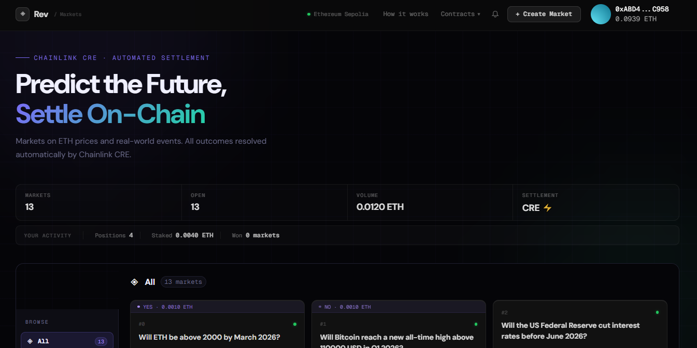

# Rev Markets — CRE Prediction Market

AI-powered prediction markets on Ethereum Sepolia. Ask any yes/no question, stake ETH on the outcome, and let Chainlink CRE + Google Gemini AI settle it automatically without the need for admins, manual intervention or a trusted third party.




**Live App:** [rev-market-five.vercel.app](https://rev-market-five.vercel.app/)  
**Contract:** [0xCC24b932F524ECCf11E6Eb3B8e9860046328fb71](https://sepolia.etherscan.io/address/0xCC24b932F524ECCf11E6Eb3B8e9860046328fb71#code) · Ethereum Sepolia · Verified ✅

---

## Chainlink CRE File References

All files that use or integrate Chainlink CRE are linked below.

| File | Chainlink Usage |
|---|---|
| [`cre-contracts/my-project/my-workflow/main.ts`](https://github.com/livinalt/Rev-Market/blob/master/cre-contracts/my-project/my-workflow/main.ts) | Defines the EVM Log Trigger — watches for `SettlementRequested` events on Ethereum Sepolia |
| [`cre-contracts/my-project/my-workflow/logCallback.ts`](https://github.com/livinalt/Rev-Market/blob/master/cre-contracts/my-project/my-workflow/logCallback.ts) | Core CRE handler — reads the event, calls Gemini AI, writes result back on-chain via `onReport()` |
| [`cre-contracts/my-project/my-workflow/gemini.ts`](https://github.com/livinalt/Rev-Market/blob/master/cre-contracts/my-project/my-workflow/gemini.ts) | Gemini AI integration called from within the CRE workflow |
| [`cre-contracts/my-project/my-workflow/httpCallback.ts`](https://github.com/livinalt/Rev-Market/blob/master/cre-contracts/my-project/my-workflow/httpCallback.ts) | HTTP trigger handler for manual CRE workflow invocation |
| [`cre-contracts/my-project/my-workflow/workflow.yaml`](https://github.com/livinalt/Rev-Market/blob/master/cre-contracts/my-project/my-workflow/workflow.yaml) | CRE workflow definition — trigger type, chain, gas limit, steps |
| [`cre-contracts/my-project/my-workflow/config.staging.json`](https://github.com/livinalt/Rev-Market/blob/master/cre-contracts/my-project/my-workflow/config.staging.json) | Chain + contract address config for the CRE deployment |
| [`cre-contracts/my-project/my-workflow/secrets.yaml`](https://github.com/livinalt/Rev-Market/blob/master/cre-contracts/my-project/secrets.yaml) | Maps `GEMINI_API_KEY` secret for use inside the CRE workflow |
| [`cre-contracts/src/PredictionMarket.sol`](https://github.com/livinalt/Rev-Market/blob/master/cre-contracts/src/PredictionMarket.sol) | `onReport()` — the on-chain function CRE calls to write settlement results; `requestSettlement()` — emits the event CRE listens for |
| [`frontend/src/App.jsx`](https://github.com/livinalt/Rev-Market/blob/master/frontend/src/App.jsx) | `watchContractEvent("MarketSettled")` — listens for the event CRE emits after settlement for instant UI update |

**Workflow summary:** EVM Log Trigger on `SettlementRequested(uint256, string)` → TypeScript workflow queries Google Gemini AI → EVM Write calls `onReport()` on Ethereum Sepolia.

---

## What It Does

Rev Markets is a trustless prediction market where:

1. Anyone creates a yes/no question market (e.g. "Will ETH be above $3000 by June 2026?") with an optional IPFS-pinned description
2. Users stake 0.001 ETH on YES or NO
3. Anyone triggers AI settlement by clicking `Request Settlement` on any open market
4. Chainlink CRE detects the on-chain event, queries Google Gemini AI for the outcome
5. Gemini returns YES or NO with a confidence score, CRE writes it back on-chain — the frontend detects settlement instantly via `watchContractEvent`
6. Winners claim their proportional share of the ETH pool

---

## Architecture

```
User clicks Request AI Settlement
           │
           ▼
PredictionMarket.sol
requestSettlement(marketId)
emits SettlementRequested(marketId, question)
           │
           ▼
Chainlink CRE — EVM Log Trigger
Detects SettlementRequested event on Ethereum Sepolia
           │
           ▼
CRE TypeScript Workflow
├── Step 1: Read market state on-chain (getMarket)
├── Step 2: Query Google Gemini AI with the question
├── Step 3: Parse YES/NO + confidence score
└── Step 4: Call onReport() to settle market on-chain
           │
           ▼
PredictionMarket.sol
onReport() → market.settled = true
             market.outcome = YES/NO
             market.confidence = %
           │
           ▼
Frontend detects MarketSettled event instantly (viem watchContractEvent)
UI updates immediately — no polling delay
           │
           ▼
Winners call claim(marketId)
Receive proportional ETH payout from pool
```

---

## Tech Stack

| Layer | Technology |
|---|---|
| Smart Contract | Solidity 0.8.24, Foundry, Ethereum Sepolia |
| Automation | Chainlink CRE — EVM Log Trigger + EVM Write |
| AI Settlement | Google Gemini 2.0 Flash |
| Description Storage | IPFS via Pinata (CID stored on-chain) |
| Frontend | React 19, Vite, Thirdweb SDK |
| Wallet Auth | Thirdweb ConnectButton |
| Event Detection | viem `watchContractEvent` |
| Monitoring & Simulation | Tenderly — Virtual TestNet + Transaction Tracer |

---

## Smart Contract

**`PredictionMarket.sol`**: single contract handles everything:

- `createMarket(string question, string descriptionCID)`: create a yes/no market with optional IPFS description
- `predict(uint256 marketId, uint8 side)`: stake 0.001 ETH on YES (0) or NO (1)
- `requestSettlement(uint256 marketId)` : trigger CRE + Gemini settlement
- `onReport(uint256 marketId, uint8 outcome, uint16 confidence)` : CRE writes result
- `claim(uint256 marketId)` : winners withdraw proportional ETH payout
- `getMarket(uint256 marketId)` : read full market state including `descriptionCID`
- `getPrediction(uint256 marketId, address user)` : read user position

**Market struct fields:** `creator`, `createdAt`, `settledAt`, `settled`, `confidence`, `outcome`, `totalYesPool`, `totalNoPool`, `question`, `descriptionCID`

**Deployed:** `0xCC24b932F524ECCf11E6Eb3B8e9860046328fb71`  
**Forwarder on Sepolia Testnet:** `0x15fC6ae953E024d975e77382eEeC56A9101f9F88`  
**Verified:** [View on Etherscan ↗](https://sepolia.etherscan.io/address/0xCC24b932F524ECCf11E6Eb3B8e9860046328fb71#code)

---

## IPFS Description Storage

Market descriptions are stored on IPFS (via Pinata) with only the CID stored on-chain.

**Write flow (market creation):**
1. Frontend uploads JSON to Pinata: `{ question, description, createdAt }`
2. Pinata returns a CID (e.g. `QmXyz...`)
3. `createMarket(question, cid)` stores the CID on-chain
4. Descriptions are optional

**Read flow (market detail modal):**
1. `getMarket()` returns the CID from chain
2. Frontend fetches from dedicated Pinata gateway
3. Results are cached in memory to avoid redundant fetches

---

## CRE Workflow

The CRE workflow lives in [cre-contracts/my-project/my-workflow/](https://github.com/livinalt/Rev-Market/tree/master/cre-contracts/my-project/my-workflow):

| File | Purpose |
|---|---|
| `main.ts` | Entry point — EVM Log Trigger setup |
| `logCallback.ts` | Handles SettlementRequested events |
| `gemini.ts` | Queries Gemini AI, parses YES/NO + confidence |
| `httpCallback.ts` | HTTP trigger handler |
| `config.staging.json` | Contract address + chain config |
| `workflow.yaml` | CRE workflow definition |
| `secrets.yaml` | Maps GEMINI_API_KEY secret |

**Trigger:** EVM Log on `SettlementRequested(uint256,string)` event  
**Chain:** Ethereum Sepolia (`ethereum-testnet-sepolia`)  
**Gas limit:** 500,000

---

## Frontend — Event-Based Settlement Detection

Settlement detection uses `viem.watchContractEvent`. The UI updates the moment the `MarketSettled` event is emitted on-chain.

```
requestSettlement() tx confirmed
        │
        ▼
viem watchContractEvent("MarketSettled")
        │
        ▼  ← fires instantly on event
onSettlementConfirmed(marketId)
├── removes pending_settlement flag
├── updates market in state via readMarketDirect()
└── triggers full silent refresh
```

---

## Notifications

Per-wallet notification history 

Events tracked: market created, prediction placed, settlement requested (with live pending/stale/resolved states), market won, market lost, winnings claimed.

---

## Repository Structure

```
cre-prediction-market-2/
├── cre-contracts/
│   ├── src/
│   │   └── PredictionMarket.sol      # Main contract (onReport, requestSettlement)
│   ├── foundry.toml
│   └── my-project/
│       └── my-workflow/
│           ├── main.ts               # CRE EVM Log Trigger entry point
│           ├── logCallback.ts        # CRE event handler → Gemini → onReport
│           ├── gemini.ts             # Gemini AI integration
│           ├── httpCallback.ts       # HTTP trigger handler
│           ├── config.staging.json   # Chain + contract config
│           ├── workflow.yaml         # CRE workflow definition
│           └── secrets.yaml          # Secret mappings
└── frontend/
    ├── src/
    │   ├── App.jsx                   # watchContractEvent settlement detection
    │   ├── components/
    │   │   ├── Header.jsx
    │   │   ├── MarketCard.jsx
    │   │   ├── MarketDetailModal.jsx  # IPFS description fetch
    │   │   ├── MarketGrid.jsx
    │   │   ├── CreateMarketModal.jsx  # Pinata IPFS upload
    │   │   ├── NotificationPanel.jsx
    │   │   ├── StatsBar.jsx
    │   │   └── Toast.jsx
    │   └── lib/
    │       ├── contracts.js           # ABI + addresses
    │       ├── useNotifications.js    # Per-wallet notification state
    │       └── utils.js
    └── package.json
```

---

## Getting Started

### Prerequisites

- [Node.js](https://nodejs.org) v18+
- [Foundry](https://getfoundry.sh)
- [Chainlink CRE CLI](https://docs.chain.link/cre)
- Ethereum Sepolia wallet with test ETH ([faucet](https://sepoliafaucet.com))
- [Gemini API key](https://aistudio.google.com)
- [Thirdweb client ID](https://thirdweb.com)
- [Pinata account](https://app.pinata.cloud)

---

### 1. Clone the repo

```bash
git clone https://github.com/livinalt/cre-prediction-market-2.git
cd cre-prediction-market-2
```

### 2. Deploy the contract

```bash
cd cre-contracts

cp .env.example .env


forge create src/PredictionMarket.sol:PredictionMarket \
  --rpc-url $SEPOLIA_RPC \
  --private-key $CRE_ETH_PRIVATE_KEY \
  --constructor-args 0x15fC6ae953E024d975e77382eEeC56A9101f9F88 \
  --broadcast

forge verify-contract <DEPLOYED_ADDRESS> \
  src/PredictionMarket.sol:PredictionMarket \
  --chain sepolia \
  --etherscan-api-key $ETHERSCAN_API_KEY \
  --constructor-args $(cast abi-encode "constructor(address)" 0x15fC6ae953E024d975e77382eEeC56A9101f9F88)
```

### 3. Set up the CRE workflow

```bash
cd cre-contracts/my-project

cp secrets.yaml.example secrets.yaml
# Fill in GEMINI_API_KEY_VAR

echo "CRE_ETH_PRIVATE_KEY=0x..." > .env
echo "GEMINI_API_KEY_VAR=your_key" >> .env


npm install

# Simulate the workflow
cre workflow simulate my-workflow --broadcast
# Select: Log trigger and paste a requestSettlement tx hash from Etherscan
```

### 4. Run the frontend

```bash
cd frontend

npm install 

cp .env.example .env
# VITE_PINATA_JWT=eyJhbGciOiJIUzI1NiIsInR5cCI6IkpXVCJ9...

npm run dev
```

### 5. Deploy to Vercel

```bash
npm run build
vercel --prod
# Set VITE_PINATA_JWT in Vercel 
```

---

## End-to-End Demo Flow


### 1. Create a market


```bash
cast send 0xCC24b932F524ECCf11E6Eb3B8e9860046328fb71 \
  "createMarket(string,string)" \
  "Will ETH be above 2000 USD by March 2026?" "" \
  --rpc-url $SEPOLIA_RPC --private-key $CRE_ETH_PRIVATE_KEY
  ```


### 2. Place a prediction (YES = 0, NO = 1)


```bash
cast send 0xCC24b932F524ECCf11E6Eb3B8e9860046328fb71 \
  "predict(uint256,uint8)" 0 0 \
  --value 0.001ether \
  --rpc-url $SEPOLIA_RPC --private-key $CRE_ETH_PRIVATE_KEY
  ````

### 3. Request AI settlement

```bash
cast send 0xCC24b932F524ECCf11E6Eb3B8e9860046328fb71 \
  "requestSettlement(uint256)" 0 \
  --rpc-url $SEPOLIA_RPC --private-key $CRE_ETH_PRIVATE_KEY
  ```


### 4. Simulate CRE workflow

```
cre workflow simulate my-workflow --broadcast

Select Log trigger and  paste tx hash from step 3
```


### 5. Claim winnings


```bash
cast send 0xCC24b932F524ECCf11E6Eb3B8e9860046328fb71 \
  "claim(uint256)" 0 \
  --rpc-url $SEPOLIA_RPC --private-key $CRE_ETH_PRIVATE_KEY
```


## Key Transactions (Sepolia)

| Action | Tx Hash |
|---|---|
| Contract deployment | `0xCC24b932F524ECCf11E6Eb3B8e9860046328fb71` |
| market created | `0xbc0f6871ef1555f9feadb1b65cf23888a3d2d290a46f3a984db4496c364c1479` |
| prediction placed | `0xd89b67abdfc1e113338cc1b2094c709b1f3b8bdec68a6f730cc067f69912f13a` |
| Settlement requested | `0xea617cbb8cee8ac9370eb358140f586aa94df512ab64c41019e1d133aeb21d05` |

---

## Tenderly Integration


**1. Transaction Monitoring** — every transaction on `PredictionMarket.sol` is visible with full execution traces, decoded logs, state diffs, and gas breakdowns.

**2. Transaction Simulation** — previews exact state changes and potential reverts before broadcasting. Used to verify settlement logic and payout calculations.

**3. Virtual TestNet** — forked Ethereum Sepolia environment used for full end-to-end testing before going live.

🔗 **Tenderly Dashboard:** [View Project ↗](https://dashboard.tenderly.co/Jerly/cx/testnet/6b716f89-d035-49ad-a3c2-a6f63fc442b0)

---

## Environment Variables

### `cre-contracts/.env`
```
CRE_ETH_PRIVATE_KEY=0x...
SEPOLIA_RPC=https://ethereum-sepolia-rpc.publicnode.com
MARKET_ADDRESS=0xCC24b932F524ECCf11E6Eb3B8e9860046328fb71
ETHERSCAN_API_KEY=...
```

### `cre-contracts/my-project/.env`
```
CRE_ETH_PRIVATE_KEY=0x...
GEMINI_API_KEY_VAR=...
```

### `frontend/.env`
```
VITE_PINATA_JWT=eyJhbGciOiJIUzI1NiIsInR5cCI6IkpXVCJ9...
```

---

## Built With

- [Chainlink CRE](https://docs.chain.link/cre) — Compute, trigger, and write automation
- [Google Gemini AI](https://ai.google.dev) — Natural language market resolution
- [Pinata](https://pinata.cloud) — IPFS pinning for market descriptions
- [Tenderly](https://tenderly.co) — Transaction monitoring, simulation, and Virtual TestNet
- [Thirdweb](https://thirdweb.com) — Wallet connection + contract interaction
- [viem](https://viem.sh) — Event-based settlement detection via `watchContractEvent`
- [Foundry](https://getfoundry.sh) — Smart contract development + testing
- [Vite + React](https://vitejs.dev) — Frontend framework

---

## License

MIT# Rev Markets — CRE Prediction Market

AI-powered prediction markets on Ethereum Sepolia. Ask any yes/no question, stake ETH on the outcome, and let Chainlink CRE + Google Gemini AI settle it automatically without the need for admins, manual intervention or a trusted third party.


**Live App:** [rev-market-five.vercel.app](https://rev-market-five.vercel.app/)  
**Contract:** [0xCC24b932F524ECCf11E6Eb3B8e9860046328fb71](https://sepolia.etherscan.io/address/0xCC24b932F524ECCf11E6Eb3B8e9860046328fb71#code) · Ethereum Sepolia · Verified ✅

---

## Chainlink CRE File References

All files that use or integrate Chainlink CRE are linked below.

| File | Chainlink Usage |
|---|---|
| [`cre-contracts/my-project/my-workflow/main.ts`](https://github.com/livinalt/Rev-Market/blob/master/cre-contracts/my-project/my-workflow/main.ts) | Defines the EVM Log Trigger — watches for `SettlementRequested` events on Ethereum Sepolia |
| [`cre-contracts/my-project/my-workflow/logCallback.ts`](https://github.com/livinalt/Rev-Market/blob/master/cre-contracts/my-project/my-workflow/logCallback.ts) | Core CRE handler — reads the event, calls Gemini AI, writes result back on-chain via `onReport()` |
| [`cre-contracts/my-project/my-workflow/gemini.ts`](https://github.com/livinalt/Rev-Market/blob/master/cre-contracts/my-project/my-workflow/gemini.ts) | Gemini AI integration called from within the CRE workflow |
| [`cre-contracts/my-project/my-workflow/httpCallback.ts`](https://github.com/livinalt/Rev-Market/blob/master/cre-contracts/my-project/my-workflow/httpCallback.ts) | HTTP trigger handler for manual CRE workflow invocation |
| [`cre-contracts/my-project/my-workflow/workflow.yaml`](https://github.com/livinalt/Rev-Market/blob/master/cre-contracts/my-project/my-workflow/workflow.yaml) | CRE workflow definition — trigger type, chain, gas limit, steps |
| [`cre-contracts/my-project/my-workflow/config.staging.json`](https://github.com/livinalt/Rev-Market/blob/master/cre-contracts/my-project/my-workflow/config.staging.json) | Chain + contract address config for the CRE deployment |
| [`cre-contracts/my-project/my-workflow/secrets.yaml`](https://github.com/livinalt/Rev-Market/blob/master/cre-contracts/my-project/secrets.yaml) | Maps `GEMINI_API_KEY` secret for use inside the CRE workflow |
| [`cre-contracts/src/PredictionMarket.sol`](https://github.com/livinalt/Rev-Market/blob/master/cre-contracts/src/PredictionMarket.sol) | `onReport()` — the on-chain function CRE calls to write settlement results; `requestSettlement()` — emits the event CRE listens for |
| [`frontend/src/App.jsx`](https://github.com/livinalt/Rev-Market/blob/master/frontend/src/App.jsx) | `watchContractEvent("MarketSettled")` — listens for the event CRE emits after settlement for instant UI update |

**Workflow summary:** EVM Log Trigger on `SettlementRequested(uint256, string)` → TypeScript workflow queries Google Gemini AI → EVM Write calls `onReport()` on Ethereum Sepolia.

---

## What It Does

Rev Markets is a trustless prediction market where:

1. Anyone creates a yes/no question market (e.g. "Will ETH be above $3000 by June 2026?") with an optional IPFS-pinned description
2. Users stake 0.001 ETH on YES or NO
3. Anyone triggers AI settlement by clicking `Request Settlement` on any open market
4. Chainlink CRE detects the on-chain event, queries Google Gemini AI for the outcome
5. Gemini returns YES or NO with a confidence score, CRE writes it back on-chain — the frontend detects settlement instantly via `watchContractEvent`
6. Winners claim their proportional share of the ETH pool

---

## Architecture

```
User clicks Request AI Settlement
           │
           ▼
PredictionMarket.sol
requestSettlement(marketId)
emits SettlementRequested(marketId, question)
           │
           ▼
Chainlink CRE — EVM Log Trigger
Detects SettlementRequested event on Ethereum Sepolia
           │
           ▼
CRE TypeScript Workflow
├── Step 1: Read market state on-chain (getMarket)
├── Step 2: Query Google Gemini AI with the question
├── Step 3: Parse YES/NO + confidence score
└── Step 4: Call onReport() to settle market on-chain
           │
           ▼
PredictionMarket.sol
onReport() → market.settled = true
             market.outcome = YES/NO
             market.confidence = %
           │
           ▼
Frontend detects MarketSettled event instantly (viem watchContractEvent)
UI updates immediately — no polling delay
           │
           ▼
Winners call claim(marketId)
Receive proportional ETH payout from pool
```

---

## Tech Stack

| Layer | Technology |
|---|---|
| Smart Contract | Solidity 0.8.24, Foundry, Ethereum Sepolia |
| Automation | Chainlink CRE — EVM Log Trigger + EVM Write |
| AI Settlement | Google Gemini 2.0 Flash |
| Description Storage | IPFS via Pinata (CID stored on-chain) |
| Frontend | React 19, Vite, Thirdweb SDK |
| Wallet Auth | Thirdweb ConnectButton |
| Event Detection | viem `watchContractEvent` |
| Monitoring & Simulation | Tenderly — Virtual TestNet + Transaction Tracer |

---

## Smart Contract

**`PredictionMarket.sol`**: single contract handles everything:

- `createMarket(string question, string descriptionCID)`: create a yes/no market with optional IPFS description
- `predict(uint256 marketId, uint8 side)`: stake 0.001 ETH on YES (0) or NO (1)
- `requestSettlement(uint256 marketId)` : trigger CRE + Gemini settlement
- `onReport(uint256 marketId, uint8 outcome, uint16 confidence)` : CRE writes result
- `claim(uint256 marketId)` : winners withdraw proportional ETH payout
- `getMarket(uint256 marketId)` : read full market state including `descriptionCID`
- `getPrediction(uint256 marketId, address user)` : read user position

**Market struct fields:** `creator`, `createdAt`, `settledAt`, `settled`, `confidence`, `outcome`, `totalYesPool`, `totalNoPool`, `question`, `descriptionCID`

**Deployed:** `0xCC24b932F524ECCf11E6Eb3B8e9860046328fb71`  
**Forwarder on Sepolia Testnet:** `0x15fC6ae953E024d975e77382eEeC56A9101f9F88`  
**Verified:** [View on Etherscan ↗](https://sepolia.etherscan.io/address/0xCC24b932F524ECCf11E6Eb3B8e9860046328fb71#code)

---

## IPFS Description Storage

Market descriptions are stored on IPFS (via Pinata) with only the CID stored on-chain.

**Write flow (market creation):**
1. Frontend uploads JSON to Pinata: `{ question, description, createdAt }`
2. Pinata returns a CID (e.g. `QmXyz...`)
3. `createMarket(question, cid)` stores the CID on-chain
4. Descriptions are optional

**Read flow (market detail modal):**
1. `getMarket()` returns the CID from chain
2. Frontend fetches from dedicated Pinata gateway
3. Results are cached in memory to avoid redundant fetches

---

## CRE Workflow

The CRE workflow lives in [cre-contracts/my-project/my-workflow/](https://github.com/livinalt/Rev-Market/tree/master/cre-contracts/my-project/my-workflow):

| File | Purpose |
|---|---|
| `main.ts` | Entry point — EVM Log Trigger setup |
| `logCallback.ts` | Handles SettlementRequested events |
| `gemini.ts` | Queries Gemini AI, parses YES/NO + confidence |
| `httpCallback.ts` | HTTP trigger handler |
| `config.staging.json` | Contract address + chain config |
| `workflow.yaml` | CRE workflow definition |
| `secrets.yaml` | Maps GEMINI_API_KEY secret |

**Trigger:** EVM Log on `SettlementRequested(uint256,string)` event  
**Chain:** Ethereum Sepolia (`ethereum-testnet-sepolia`)  
**Gas limit:** 500,000

---

## Frontend — Event-Based Settlement Detection

Settlement detection uses `viem.watchContractEvent`. The UI updates the moment the `MarketSettled` event is emitted on-chain.

```
requestSettlement() tx confirmed
        │
        ▼
viem watchContractEvent("MarketSettled")
        │
        ▼  ← fires instantly on event
onSettlementConfirmed(marketId)
├── removes pending_settlement flag
├── updates market in state via readMarketDirect()
└── triggers full silent refresh
```

---

## Notifications

Per-wallet notification history 

Events tracked: market created, prediction placed, settlement requested (with live pending/stale/resolved states), market won, market lost, winnings claimed.

---

## Repository Structure

```
cre-prediction-market-2/
├── cre-contracts/
│   ├── src/
│   │   └── PredictionMarket.sol      # Main contract (onReport, requestSettlement)
│   ├── foundry.toml
│   └── my-project/
│       └── my-workflow/
│           ├── main.ts               # CRE EVM Log Trigger entry point
│           ├── logCallback.ts        # CRE event handler → Gemini → onReport
│           ├── gemini.ts             # Gemini AI integration
│           ├── httpCallback.ts       # HTTP trigger handler
│           ├── config.staging.json   # Chain + contract config
│           ├── workflow.yaml         # CRE workflow definition
│           └── secrets.yaml          # Secret mappings
└── frontend/
    ├── src/
    │   ├── App.jsx                   # watchContractEvent settlement detection
    │   ├── components/
    │   │   ├── Header.jsx
    │   │   ├── MarketCard.jsx
    │   │   ├── MarketDetailModal.jsx  # IPFS description fetch
    │   │   ├── MarketGrid.jsx
    │   │   ├── CreateMarketModal.jsx  # Pinata IPFS upload
    │   │   ├── NotificationPanel.jsx
    │   │   ├── StatsBar.jsx
    │   │   └── Toast.jsx
    │   └── lib/
    │       ├── contracts.js           # ABI + addresses
    │       ├── useNotifications.js    # Per-wallet notification state
    │       └── utils.js
    └── package.json
```

---

## Getting Started

### Prerequisites

- [Node.js](https://nodejs.org) v18+
- [Foundry](https://getfoundry.sh)
- [Chainlink CRE CLI](https://docs.chain.link/cre)
- Ethereum Sepolia wallet with test ETH ([faucet](https://sepoliafaucet.com))
- [Gemini API key](https://aistudio.google.com)
- [Thirdweb client ID](https://thirdweb.com)
- [Pinata account](https://app.pinata.cloud)

---

### 1. Clone the repo

```bash
git clone https://github.com/livinalt/cre-prediction-market-2.git
cd cre-prediction-market-2
```

### 2. Deploy the contract

```bash
cd cre-contracts

cp .env.example .env


forge create src/PredictionMarket.sol:PredictionMarket \
  --rpc-url $SEPOLIA_RPC \
  --private-key $CRE_ETH_PRIVATE_KEY \
  --constructor-args 0x15fC6ae953E024d975e77382eEeC56A9101f9F88 \
  --broadcast

forge verify-contract <DEPLOYED_ADDRESS> \
  src/PredictionMarket.sol:PredictionMarket \
  --chain sepolia \
  --etherscan-api-key $ETHERSCAN_API_KEY \
  --constructor-args $(cast abi-encode "constructor(address)" 0x15fC6ae953E024d975e77382eEeC56A9101f9F88)
```

### 3. Set up the CRE workflow

```bash
cd cre-contracts/my-project

cp secrets.yaml.example secrets.yaml
# Fill in GEMINI_API_KEY_VAR

echo "CRE_ETH_PRIVATE_KEY=0x..." > .env
echo "GEMINI_API_KEY_VAR=your_key" >> .env


npm install

# Simulate the workflow
cre workflow simulate my-workflow --broadcast
# Select: Log trigger and paste a requestSettlement tx hash from Etherscan
```

### 4. Run the frontend

```bash
cd frontend

npm install 

cp .env.example .env
# VITE_PINATA_JWT=eyJhbGciOiJIUzI1NiIsInR5cCI6IkpXVCJ9...

npm run dev
```

### 5. Deploy to Vercel

```bash
npm run build
vercel --prod
# Set VITE_PINATA_JWT in Vercel 
```

---

## End-to-End Demo Flow


### 1. Create a market


```bash
cast send 0xCC24b932F524ECCf11E6Eb3B8e9860046328fb71 \
  "createMarket(string,string)" \
  "Will ETH be above 2000 USD by March 2026?" "" \
  --rpc-url $SEPOLIA_RPC --private-key $CRE_ETH_PRIVATE_KEY
  ```


### 2. Place a prediction (YES = 0, NO = 1)


```bash
cast send 0xCC24b932F524ECCf11E6Eb3B8e9860046328fb71 \
  "predict(uint256,uint8)" 0 0 \
  --value 0.001ether \
  --rpc-url $SEPOLIA_RPC --private-key $CRE_ETH_PRIVATE_KEY
  ````

### 3. Request AI settlement

```bash
cast send 0xCC24b932F524ECCf11E6Eb3B8e9860046328fb71 \
  "requestSettlement(uint256)" 0 \
  --rpc-url $SEPOLIA_RPC --private-key $CRE_ETH_PRIVATE_KEY
  ```


### 4. Simulate CRE workflow

```
cre workflow simulate my-workflow --broadcast

Select Log trigger and  paste tx hash from step 3
```


### 5. Claim winnings


```bash
cast send 0xCC24b932F524ECCf11E6Eb3B8e9860046328fb71 \
  "claim(uint256)" 0 \
  --rpc-url $SEPOLIA_RPC --private-key $CRE_ETH_PRIVATE_KEY
```


## Key Transactions (Sepolia)

| Action | Tx Hash |
|---|---|
| Contract deployment | `0xCC24b932F524ECCf11E6Eb3B8e9860046328fb71` |
| market created | `0xbc0f6871ef1555f9feadb1b65cf23888a3d2d290a46f3a984db4496c364c1479` |
| prediction placed | `0xd89b67abdfc1e113338cc1b2094c709b1f3b8bdec68a6f730cc067f69912f13a` |
| Settlement requested | `0xea617cbb8cee8ac9370eb358140f586aa94df512ab64c41019e1d133aeb21d05` |

---

## Tenderly Integration


**1. Transaction Monitoring** — every transaction on `PredictionMarket.sol` is visible with full execution traces, decoded logs, state diffs, and gas breakdowns.

**2. Transaction Simulation** — previews exact state changes and potential reverts before broadcasting. Used to verify settlement logic and payout calculations.

**3. Virtual TestNet** — forked Ethereum Sepolia environment used for full end-to-end testing before going live.

🔗 **Tenderly Dashboard:** [View Project ↗](https://dashboard.tenderly.co/Jerly/cx/testnet/6b716f89-d035-49ad-a3c2-a6f63fc442b0)

---

## Environment Variables

### `cre-contracts/.env`
```
CRE_ETH_PRIVATE_KEY=0x...
SEPOLIA_RPC=https://ethereum-sepolia-rpc.publicnode.com
MARKET_ADDRESS=0xCC24b932F524ECCf11E6Eb3B8e9860046328fb71
ETHERSCAN_API_KEY=...
```

### `cre-contracts/my-project/.env`
```
CRE_ETH_PRIVATE_KEY=0x...
GEMINI_API_KEY_VAR=...
```

### `frontend/.env`
```
VITE_PINATA_JWT=eyJhbGciOiJIUzI1NiIsInR5cCI6IkpXVCJ9...
```

---

## Built With

- [Chainlink CRE](https://docs.chain.link/cre) — Compute, trigger, and write automation
- [Google Gemini AI](https://ai.google.dev) — Natural language market resolution
- [Pinata](https://pinata.cloud) — IPFS pinning for market descriptions
- [Tenderly](https://tenderly.co) — Transaction monitoring, simulation, and Virtual TestNet
- [Thirdweb](https://thirdweb.com) — Wallet connection + contract interaction
- [viem](https://viem.sh) — Event-based settlement detection via `watchContractEvent`
- [Foundry](https://getfoundry.sh) — Smart contract development + testing
- [Vite + React](https://vitejs.dev) — Frontend framework

---

## License

MIT
